# Level Мичуринский — инструкция для жителей

Это руководство описывает, как пользоваться приложением: регистрация, личные данные, добавление квартиры/парковки/кладовки, парковочные запросы (с обеих сторон), справочник и поиск соседей.

Названия кнопок и полей в тексте — точно такие, как в приложении, в кавычках («…»).

---

## Содержание

1. [Начало работы](#1-начало-работы)
2. [Личные данные](#2-личные-данные)
3. [Добавление объектов: квартира, парковка, кладовка](#3-добавление-объектов-квартира-парковка-кладовка)
4. [Парковка: я ищу место](#4-парковка-я-ищу-место)
5. [Парковка: я делюсь своим местом](#5-парковка-я-делюсь-своим-местом)
6. [Справочник](#6-справочник)
7. [Поиск соседей](#7-поиск-соседей)
8. [Кофе (Random Coffee)](#8-кофе-random-coffee)

---

## 1. Начало работы

1. Откройте бота в Telegram и нажмите **/start** (или кнопку «Открыть приложение», если она уже есть в чате).

   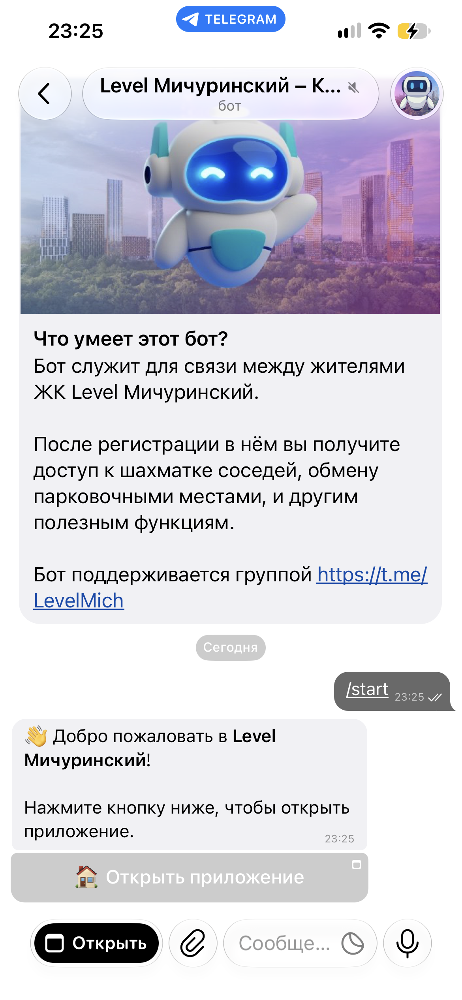

2. При первом запуске приложение сразу попросит заполнить профиль и добавить квартиру — экран «Добро пожаловать! Заполните профиль и добавьте квартиру».

   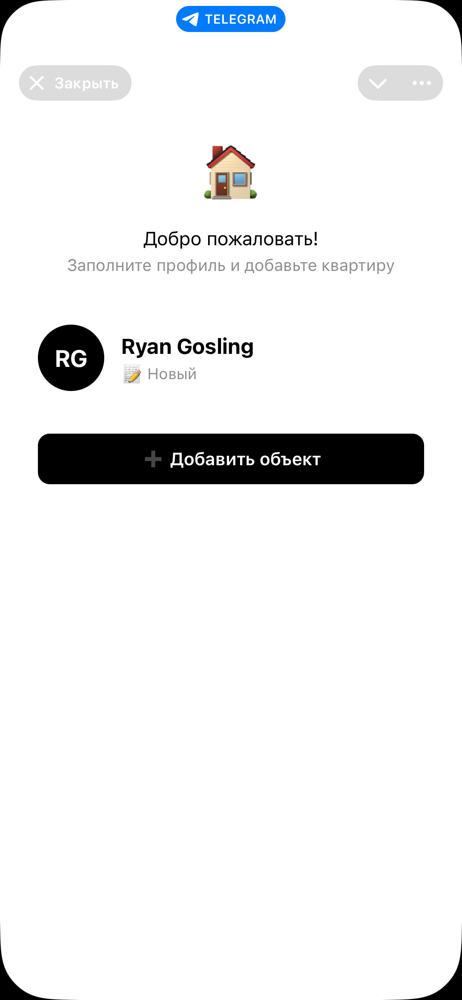

3. Заполните имя, при желании — телефон (см. [раздел 2](#2-личные-данные)), и добавьте квартиру через кнопку «➕ Добавить объект» (подробности — [раздел 3](#3-добавление-объектов-квартира-парковка-кладовка)).

4. После отправки заявка уходит администраторам ЖК на модерацию. Пока заявка не одобрена, статус в приложении — «⏳ Ожидает подтверждения», доступ к остальным разделам ограничен.

5. Как только администратор одобрит заявку, вы получите от бота:
   - сообщение с полезными ссылками (если они настроены для вашего корпуса);
   - отдельное сообщение с **одноразовыми пригласительными ссылками** в общий закрытый чат ЖК и в чат вашего корпуса — по ним вы сразу попадёте в чаты, без ожидания одобрения администратором. Ссылки одноразовые и действуют 24 часа, так что стоит перейти по ним сразу.

   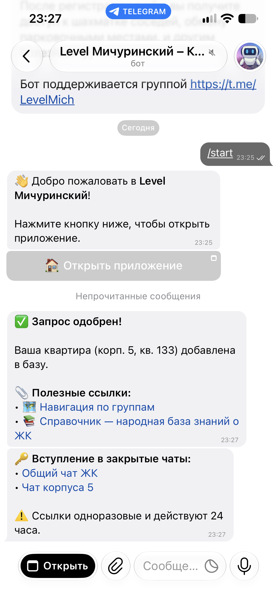

6. После одобрения в приложении открываются все пять разделов нижнего меню: **Соседи**, **Паркинг**, **Справочник**, **Кофе**, **Профиль**.

   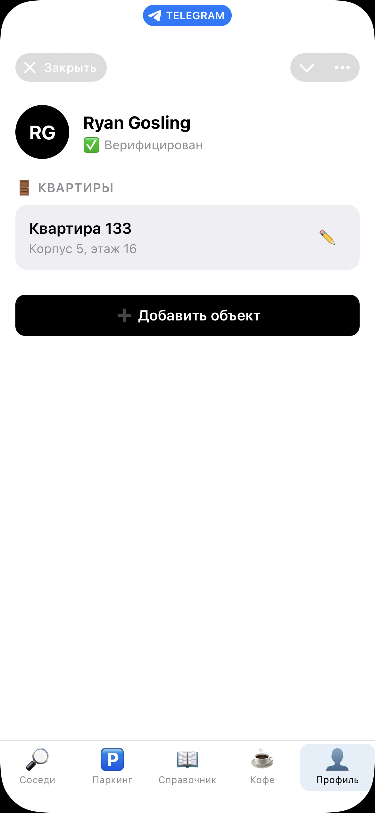

---

## 2. Личные данные

Все личные данные редактируются на вкладке **Профиль** — нажмите на своё имя/аватар в верхней части экрана.

В окне редактирования профиля доступно:

- **Имя** — обязательное поле.
- **Телефон** — вводится 10 цифр после фиксированного «+7» (без восьмёрки и без кода страны). Формат проверяется: должно быть ровно 10 цифр, первая — «9».
- **«Скрыть телефон от соседей»** — отметка (галочка). Если включена, ваш телефон не показывается другим жителям в поиске (но остаётся виден администраторам).
- **«Скрыть Telegram Username»** — аналогично, скрывает username от соседей.
- **Автомобили** — список номеров. Добавляются по одному: ввести номер в поле «Номер авто» и нажать «+» (или Enter). Удаление — крестик рядом с номером в списке.

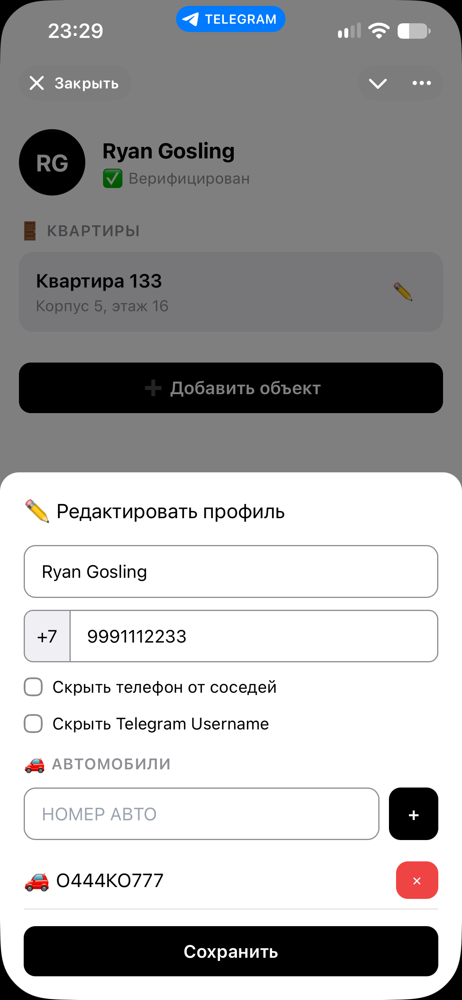

После изменений — кнопка «Сохранить» внизу окна.

**Зачем скрывать данные.** Скрытые телефон/username не отображаются в общем поиске соседей ([раздел 7](#7-поиск-соседей)), но сосед всё равно может отправить вам запрос «📨 Попросить связаться» — тогда уведомление с вашими контактами уйдёт вам в бота, а не наоборот.

---

## 3. Добавление объектов: квартира, парковка, кладовка

Все три типа объектов добавляются одинаково — на вкладке **Профиль**, кнопка «➕ Добавить объект» внизу экрана.

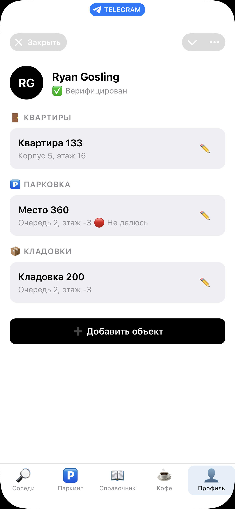

Если у вас уже есть хотя бы одна одобренная квартира, в открывшемся окне сверху появятся вкладки-переключатели 🏠 / 🅿️ / 📦 — иначе форма сразу открывается на добавлении квартиры (первый объект в ЖК обязан быть квартирой).

### Квартира

- **Корпус** — выбор из списка (1–13).
- **Этаж** — число от 1 до 55.
- **Номер квартиры** — число от 1 до 1000.
- **Тип владения** — «Собственность» / «Аренда» / «Член семьи».

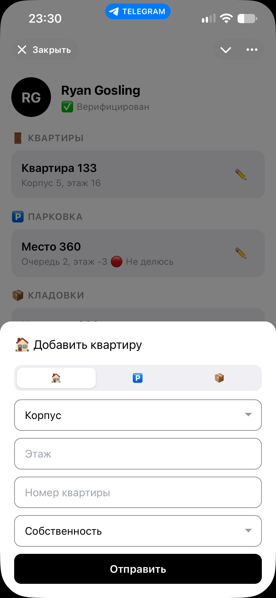

### Парковка

- **Очередь** — 1–4 (соответствует группе корпусов).
- **Этаж** — от −1 до −3. Для очередей 3 и 4 этаж всегда −1 и поле не показывается (в этих очередях один подземный уровень).
- **Номер места**.
- **Тип владения** — так же, как у квартиры.

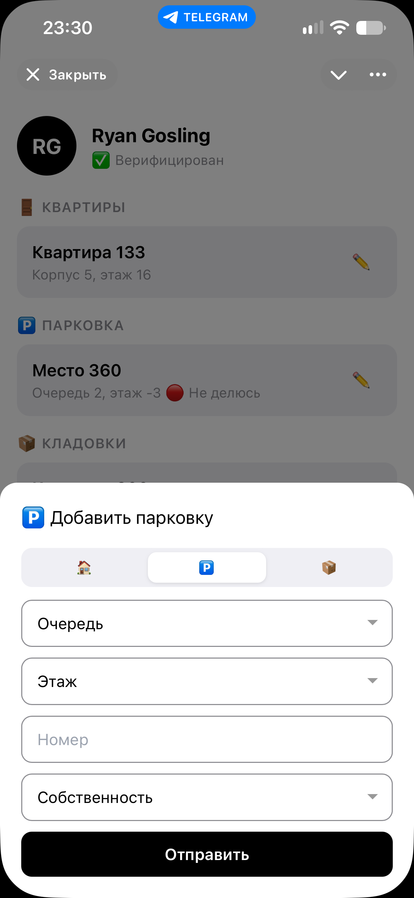

После добавления место по умолчанию не участвует в шеринге — включить это можно позже в [разделе «Паркинг → Мои места»](#5-парковка-я-делюсь-своим-местом).

### Кладовка

Поля идентичны парковке (очередь, этаж, номер, тип владения) — кладовки физически находятся в тех же подземных уровнях.

**Заявки на квартиру дополнительно проходят модерацию администратором** (заявки на парковку/кладовку добавляются сразу, без ожидания). Пока заявка на квартиру не одобрена, у неё статус «⏳ Ожидает» в списке на вкладке «Профиль».

**Редактирование и удаление.** У каждого добавленного объекта в списке есть карандаш «✏️» — открывает те же поля для правки, внизу окна — кнопки «Сохранить» и «🗑 Удалить».

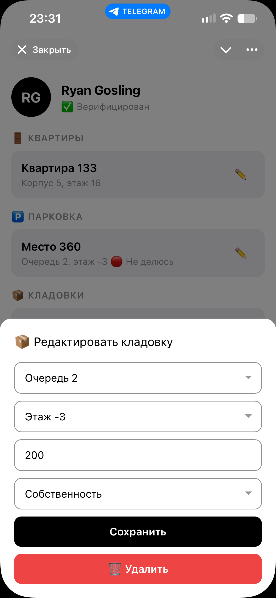

---

## 4. Парковка: я ищу место

Раздел **Паркинг → 🔍 Найти** — для тех, кому нужно арендовать место у соседа на определённый период (например, на время визита гостей).

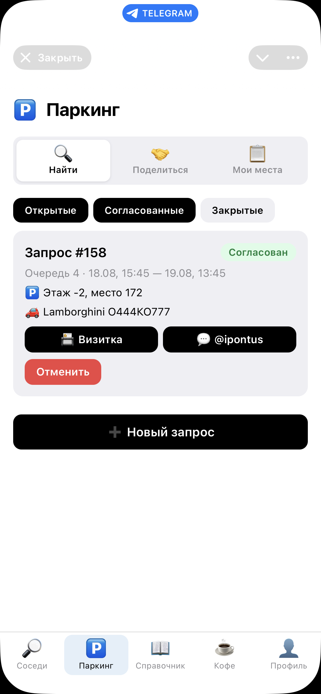

### Создание запроса

1. Кнопка «➕ Новый запрос» внизу экрана.
2. **Очередь** — можно выбрать сразу несколько (запрос уйдёт владельцам мест во всех выбранных очередях).
3. **Марка автомобиля** и **номер автомобиля** — под полями показываются недавно использованные значения как быстрые кнопки, если вы уже указывали их раньше.
4. **Начало аренды** и **конец аренды** — дата и время, с точностью до 15 минут. Оба момента должны быть в будущем, конец — позже начала.
5. «Отправить».

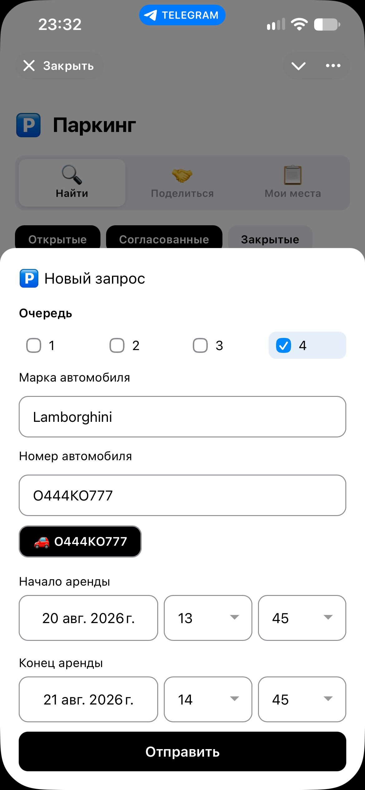

### Что происходит дальше

Запрос уходит **всем** владельцам мест в выбранных очередях, у кого включён шеринг («Делюсь») — не одному конкретному человеку.

Статус запроса виден цветной надписью в карточке:

| Статус | Значение |
|---|---|
| Открыт | Ждёт, чтобы кто-то из владельцев принял (в том числе повторно открытые после отмены) |
| Согласован | Владелец принял, место назначено — надпись остаётся той же и после того, как аренда фактически началась |
| Закрыт | Завершён или отменён |

Фильтр статусов сверху списка («Открытые» / «Согласованные» / «Закрытые») позволяет не листать историю целиком.

Как только запрос согласован, в карточке появляются:
- номер этажа и места;
- кнопки связи с владельцем — «📇 Визитка» (бот пришлёт контактную карточку в личку) и «💬 @username» (открыть чат с владельцем напрямую, если у него не скрыт username).

Пока запрос открыт или согласован — доступна кнопка «Отменить». Когда наступает время начала аренды, запрос переходит во внутренний статус «активна» (надпись в карточке при этом не меняется) и в карточке появляется кнопка «✅ Завершить» — закрыть бронь досрочно, если место больше не нужно.

---

## 5. Парковка: я делюсь своим местом

Если у вас есть парковочное место, вы можете сдавать его соседям на выбранные периоды — за это отвечают разделы **Паркинг → 🤝 Поделиться** и **Паркинг → 📋 Мои места**.

### Шаг 1 — включить шеринг

Раздел **Мои места**: у каждого вашего места есть переключатель «🟢 Делюсь» / «🔴 Не делюсь». Пока он выключен, ваши места не участвуют в поиске и не получают запросов.

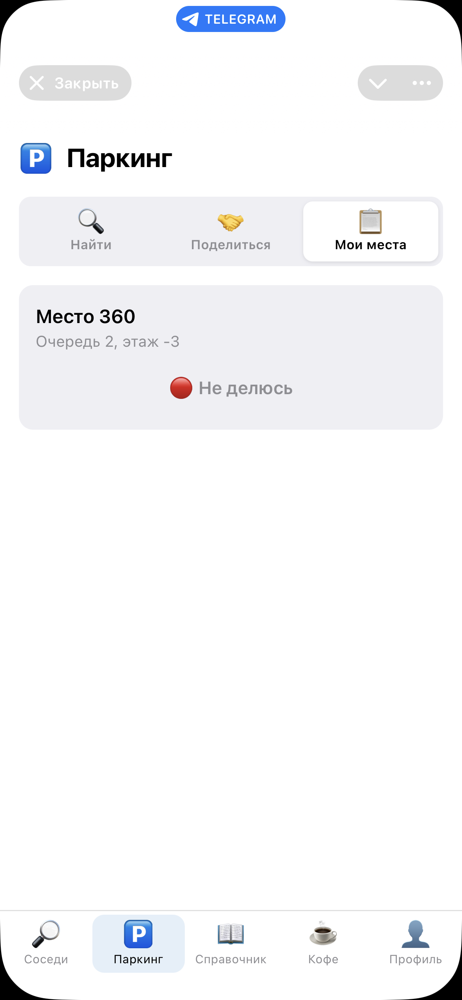

### Шаг 2 (необязательно) — расписание и блокировки

Нажатие на карточку места открывает настройки:

- **📅 Доступность** — расписание по дням недели и часам, когда вы готовы делиться местом (например, будни с 8:00 до 20:00, пока сами на работе). Если расписание не задано — уведомления о новых запросах приходят всегда, без ограничений по времени.
- **🚫 Блокировки** — конкретные даты/периоды, когда место точно занято (например, вы сами уезжаете и паркуетесь дома). На заблокированный период запросы всё равно можно получить, но это визуальная подсказка при принятии решения.

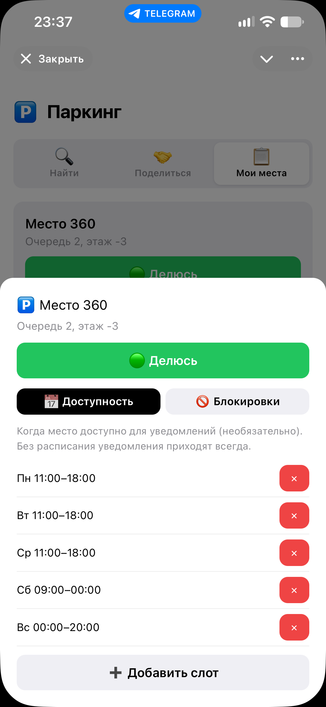

Добавление слота расписания — кнопка «➕ Добавить слот»: день недели + время начала/окончания. Добавление блокировки — «➕ Добавить блокировку»: даты/время начала и окончания.

### Шаг 3 — обработка входящих запросов

Раздел **Поделиться** показывает все актуальные запросы соседей на парковку в ваших очередях. Карточки, чьё время совпадает с вашей доступностью, подсвечены — их стоит смотреть в первую очередь.

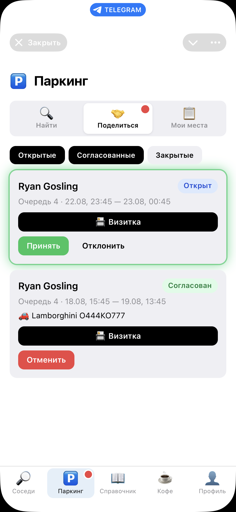

Для открытого запроса — две кнопки:
- **«Принять»** — назначает запрос на первое ваше место с включённым шерингом. После принятия бот покажет напоминание *«Не забудьте заказать гостевой пропуск для арендатора!»*.
- **«Отклонить»** — скрывает запрос из вашего списка (не отменяет его для самого жильца — он всё ещё виден другим владельцам с местами в той же очереди).

После принятия карточка переходит в статус «Согласован» — там же появляются кнопки связи с арендатором («📇 Визитка», «💬 @username») и марка/номер его автомобиля. Кнопка «Отменить» на этой стадии возвращает запрос в пул открытых (например, если планы изменились).

**Важно:** после назначения на конкретное место оно автоматически блокируется на период аренды — на это время оно не попадёт в чужой поиск свободных мест, даже если у вас несколько мест с шерингом.

---

## 6. Справочник

Вкладка **Справочник** — единая точка со всей справочной информацией по ЖК: контакты, службы, документы, статьи.

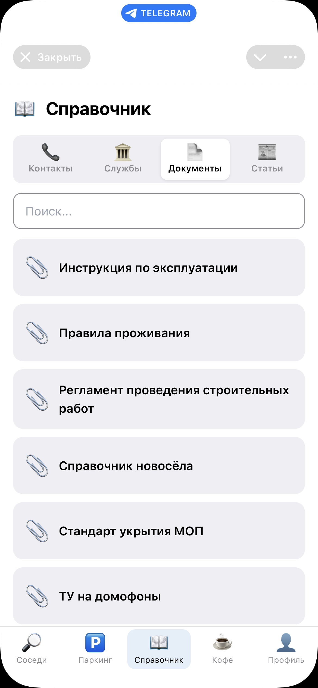

Четыре вкладки:

| Вкладка | Что внутри |
|---|---|
| 📞 Контакты | Люди/должности (например, старший по дому) — карточка с телефоном, кнопки «📇 Визитка» и «📞 <номер>» |
| 🏛️ Службы | Организации с адресом (кнопка открывает карту), сайтом и телефоном |
| 📄 Документы | Ссылки на документы (регламенты, протоколы и т.п.) |
| 📰 Статьи | Ссылки на более длинные материалы (например, статьи в Telegraph) |

Во всех разделах, кроме «Контакты», есть строка поиска по названию.

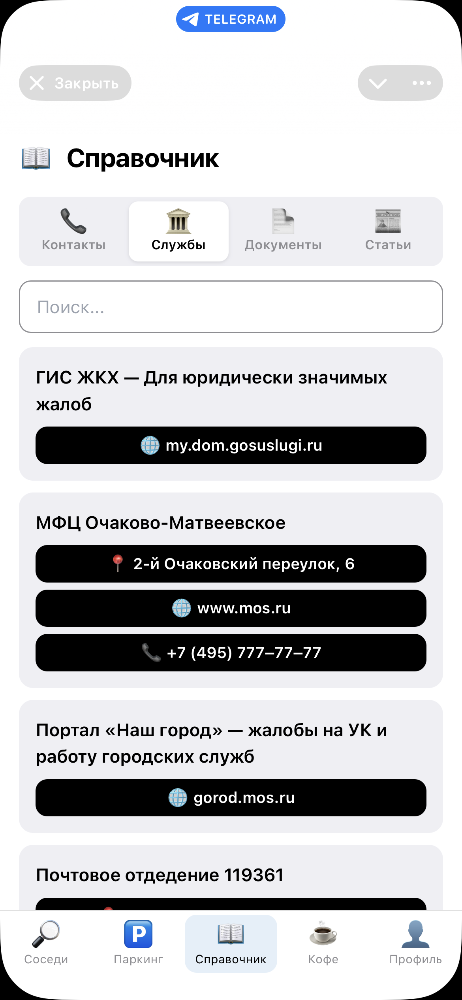

Разделы «Контакты» и «Документы»/«Статьи» могут быть видны не всем — часть материалов администраторы настраивают только для конкретных корпусов/очередей или только для верифицированных жителей в целом. Если какой-то ожидаемой карточки не видно — вероятно, она не относится к вашему корпусу; обратитесь к администратору.

---

## 7. Поиск соседей

Вкладка **Соседи** — поиск по пяти типам данных, переключатели сверху: 🚪 Квартира, 🚗 Авто, 🅿️ Паркинг, 📦 Кладовка, 👤 Люди.

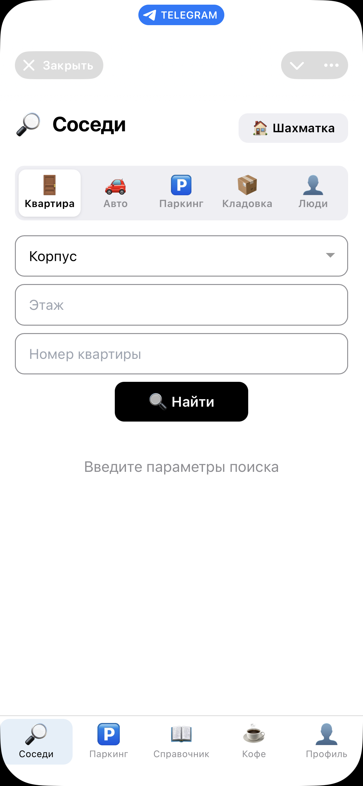

### Как это работает

- **🚪 Квартира** — поиск по корпусу/этажу/номеру (можно заполнить не все поля — например, только корпус, чтобы увидеть весь корпус).
- **🚗 Авто** — поиск по номеру машины (частичное совпадение).
- **🅿️ Паркинг** / **📦 Кладовка** — поиск по очереди/этажу/номеру места.
- **👤 Люди** — поиск по имени или Telegram-username.

Кнопка «🔍 Найти» запускает поиск, результаты — карточками ниже. Если результатов много, внизу экрана появляется постраничная навигация.

**Доступ ограничен вашими объектами.** Если вы не администратор, в выпадающих списках корпусов/очередей показываются только те, что связаны с вашими объектами: как собственник или член семьи — весь корпус (и вся ваша очередь для парковки/кладовок), как арендатор — только конкретно ваша квартира/место. Это не ограничение поиска «в лоб» — так устроены сами фильтры выбора корпуса/очереди.

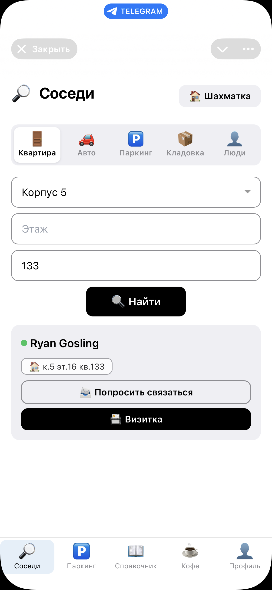

### Карточка найденного человека

Три способа связаться:

- **«📨 Попросить связаться»** — сосед получит уведомление с вашими контактами и предложением написать вам первым. Полезно, когда у собеседника скрыты телефон/username.
- **«📇 Визитка»** — бот пришлёт вам контактную карточку (vCard) собеседника в личные сообщения.
- **«💬 @username»** — открывает чат с человеком напрямую в Telegram (кнопка есть, только если у него не скрыт username).

### Шахматка

Кнопка «🏠 Шахматка» в верхней части раздела «Соседи» — визуальная карта дома: этажи по строкам, квартиры по столбцам, каждая раскрашена по типу владения жителей (🟢 собственник, 🔵 член семьи, 🟣 арендатор). Нажатие на квартиру открывает список контактов, живущих в ней.

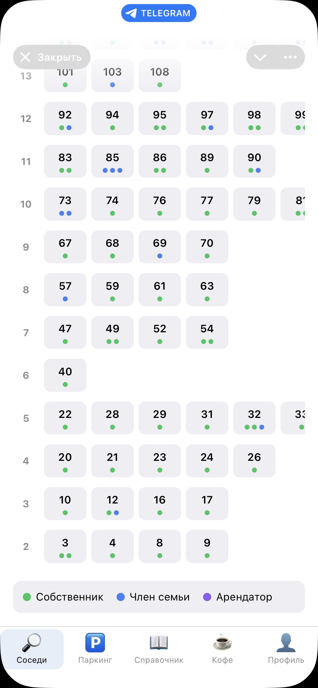

### Дополнительный способ найти человека

Если вы получили сообщение от соседа (например, в общем чате) и хотите найти его карточку в приложении — можно переслать это сообщение боту напрямую (в личные сообщения бота, не в приложение). Бот найдёт автора по Telegram ID или имени и пришлёт карточку с контактами.

---

## 8. Кофе (Random Coffee)

Вкладка **Кофе** — еженедельный автоматический подбор случайного собеседника среди активных верифицированных жителей, для нетворкинга внутри ЖК. Три вкладки: 👤 Профиль, 📨 Приглашения, ☕ Встречи.

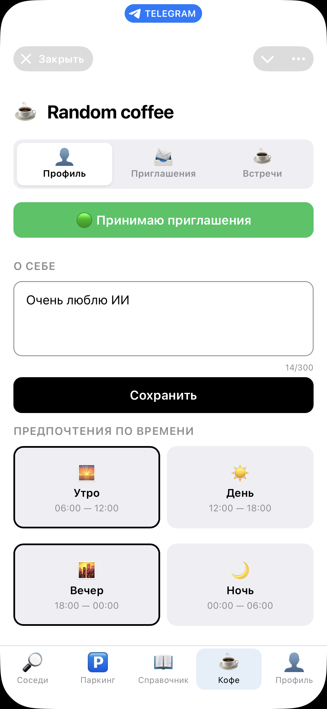

### Профиль

- Переключатель «🟢 Принимаю приглашения» / «⚪ Не принимаю приглашения» — главный переключатель участия. Пока он выключен, вас не включают в подбор пар.
- **«О себе»** — текст до 300 символов, показывается партнёру при знакомстве.
- **Предпочтения по времени** — четыре плитки: 🌅 Утро (06:00–12:00), ☀️ День (12:00–18:00), 🌆 Вечер (18:00–00:00), 🌙 Ночь (00:00–06:00). Можно отметить несколько — это ориентир для партнёра, когда вам удобнее встретиться; сам подбор пар от выбранного времени не зависит.

### Как проходит подбор

Раз в неделю (по умолчанию — понедельник, 10:00 по Москве) бот автоматически формирует пары среди тех, у кого включено «Принимаю приглашения». Оба участника получают приглашение на вкладке «📨 Приглашения» и уведомление от бота.

### Приглашения

Карточка приглашения показывает имя партнёра (нажатие открывает его Telegram-профиль), текст «О себе» (если заполнен), предпочитаемое время и период недели. Кнопки связи — те же «📨 Попросить связаться» и «💬 @username» / «📇 Визитка», что и в поиске соседей.

Ниже — «Принять» / «Отклонить». Встреча состоится, только если согласны **оба** участника: если вы уже приняли, а партнёр ещё нет, карточка показывает «⏳ Ожидаем ответа партнёра» вместо кнопок.

### Встречи

Вкладка «☕ Встречи» — история пар со статусом («Приглашение» / «Принято» / «Отклонено» / «Завершено») рядом с именем партнёра и теми же контактными кнопками.

---

## Что не описано в этом руководстве

Функции **Администратора** (одобрение заявок, рассылки, статистика, редактирование справочника) — отдельная, более узкая тема, не входящая в базовый онбординг; можно дописать отдельным руководством по запросу.
